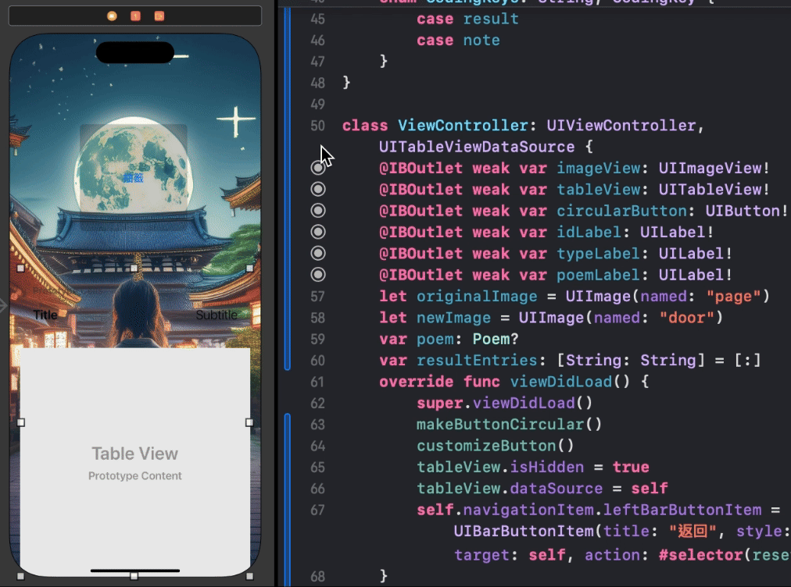

# Asakusa Shrine 100 Fortunes iOS App

This project is a Swift iOS application designed to display fortunes from the Asakusa Shrine. The fortunes are stored in Google Apps Script and can be accessed via an API. The app allows users to fetch specific fortunes using a query parameter.

## Screen





## Features

- Fetches fortunes using an API with query parameters.
- Displays the content of the fortune in a user-friendly interface.
- Supports retrieval of specific fortunes by number.

## Installation

1. Clone the repository:
   ```bash
   git clone https://github.com/yourusername/asakusa-shrine-100-fortunes.git
   ```
2. Open the project in Xcode:
   ```bash
   cd asakusa-shrine-100-fortunes
   open AsakusaShrine100Fortunes.xcodeproj
   ```
3. Install dependencies (if any).
4. Build and run the project on your preferred iOS device or simulator.

## Usage

1. Launch the app on your iOS device.
2. Enter the number of the fortune you want to retrieve.
3. The app will fetch the fortune data from the Google Apps Script API and display it.

## API

The app uses a Google Apps Script API to fetch fortune data. The URL format is as follows:
```
https://script.google.com/macros/s/AKfycbzgLMd3zq4epimJz2nV98oJ_UkE8W0EvgeBvvKdiqvzO5wXbQaKU3bYIAgM-_lgElSkcw/exec?number={fortune_number}
```
Replace `{fortune_number}` with the specific number (1-100) of the fortune you want to retrieve.

## Example

To fetch the 87th fortune, the URL would be:
```
https://script.google.com/macros/s/your_script_id/exec?number=87
```

## Contributing

1. Fork the repository.
2. Create a new branch:
   ```bash
   git checkout -b feature-branch
   ```
3. Make your changes and commit them:
   ```bash
   git commit -m 'Add some feature'
   ```
4. Push to the branch:
   ```bash
   git push origin feature-branch
   ```
5. Open a pull request.

## License

This project is licensed under the MIT License. See the [LICENSE](LICENSE) file for more information.
